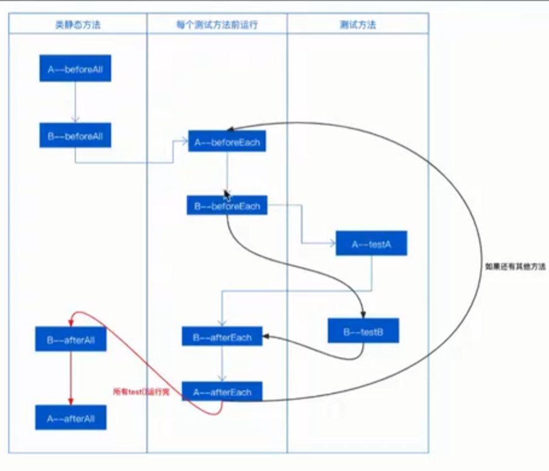

JUnit5总结

1. 必须以Test开头或者以Test结尾，如果不满足，在IDEA下可以运行。但是在maven终端下执行mvn test，则不会执行没满足的类名
2. 如果想改变命名规则，那么可以配置pom来改变自定义命名规则，但是这回覆盖Test开头或者以Test结尾的规则
3. 一条测试用例存在多个断言，执行到出错的这个断言就会停止向下执行。如果想要全部都执行，那么使用assertAll
4. 如果存在类继承，那么用例顺序是；先蓝后黑最后红；如果子类的方法名跟父类的方法名一致了，那么就是重写，会覆盖父类的实现